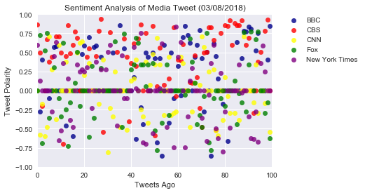
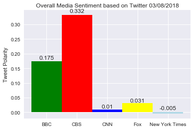

```python
# Dependencies
import numpy as np
import pandas as pd
import matplotlib.pyplot as plt
import json
import tweepy
import time
import seaborn as sns
# Initialize Sentiment Analyzer
from vaderSentiment.vaderSentiment import SentimentIntensityAnalyzer
analyzer = SentimentIntensityAnalyzer()
%matplotlib inline
```


```python
#Need to hide the key later
from config import (consumer_key, 
                    consumer_secret, 
                    access_token, 
                    access_token_secret)
```


```python
organization = ["@BBC", "@CBS", "@CNN", "@FoxNews", "@nytimes"]
auth = tweepy.OAuthHandler(consumer_key, consumer_secret)
auth.set_access_token(access_token, access_token_secret)
api = tweepy.API(auth)
all_sentiments = [] 
for user in organization:
    sentiments = []
    counter = 0 
    #public_tweets = api.search(user, count=10, result_type="recent")
    public_tweets = api.user_timeline(user, count = 100, result_type = "recent")
    for tweet in public_tweets:
        tweet = json.dumps(tweet._json, indent=3)
        tweet = json.loads(tweet)
        compound = analyzer.polarity_scores(tweet["text"])["compound"]
        pos = analyzer.polarity_scores(tweet["text"])["pos"]
        neu = analyzer.polarity_scores(tweet["text"])["neu"]
        neg = analyzer.polarity_scores(tweet["text"])["neg"]
        tweets_ago = counter
        
        # Add sentiments for each tweet into an array
        sentiments.append({"Date": tweet["created_at"], 
                           "Compound": compound,
                           "Positive": pos,
                           "Negative": neu,
                           "Neutral": neg,
                           "Tweets Ago": counter})
        # Add to counter 
        counter = counter + 1
    all_sentiments.append(sentiments)
```


```python
#Create dataframe for each organization
BBC = pd.DataFrame(all_sentiments[0])
CBS = pd.DataFrame(all_sentiments[1])
CNN = pd.DataFrame(all_sentiments[2])
Fox = pd.DataFrame(all_sentiments[3])
NYTimes = pd.DataFrame(all_sentiments[4])
```


```python
BBC.to_csv("BBC Sentiments.csv")
CBS.to_csv("CBS Sentiments.csv")
CNN.to_csv("CNN Sentiments.csv")
Fox.to_csv("Fox Sentiments.csv")
NYTimes.to_csv("NewYorkTimes Sentiments.csv")
```


```python
sns.set(color_codes=True)
sns.regplot(x= "Tweets Ago", y = "Compound", data = BBC, color = 'darkblue',fit_reg=False, label = "BBC")
sns.regplot(x= "Tweets Ago", y = "Compound", data = CBS, color = 'red',fit_reg=False, label = "CBS")
sns.regplot(x= "Tweets Ago", y = "Compound", data = CNN, color = 'yellow',fit_reg=False, label = "CNN")
sns.regplot(x= "Tweets Ago", y = "Compound", data = Fox, color = 'green',fit_reg=False, label = "Fox")
sns.regplot(x= "Tweets Ago", y = "Compound", data = NYTimes, color = 'purple',fit_reg=False, label = "New York Times")
plt.title("Sentiment Analysis of Media Tweet (03/08/2018)")
plt.ylim(-1, 1)
plt.xlim(0, 100)
plt.ylabel("Tweet Polarity")
plt.xlabel("Tweets Ago")
plt.legend(bbox_to_anchor=(1.05, 1), loc=2, borderaxespad=0.)
plt.savefig("Sentiment Analysis of Media Tweet.png")
```





```python
compound_sentiments = pd.DataFrame({"BBC": [BBC['Compound'].sum()/100], "CBS": [CBS['Compound'].sum()/100], "CNN": [CNN['Compound'].sum()/100], "Fox": [Fox['Compound'].sum()/100], "New York Times": [NYTimes['Compound'].sum()/100]})
compound_sentiments
```


<div>
<style scoped>
    .dataframe tbody tr th:only-of-type {
        vertical-align: middle;
    }

    .dataframe tbody tr th {
        vertical-align: top;
    }

    .dataframe thead th {
        text-align: right;
    }
</style>
<table border="1" class="dataframe">
  <thead>
    <tr style="text-align: right;">
      <th></th>
      <th>BBC</th>
      <th>CBS</th>
      <th>CNN</th>
      <th>Fox</th>
      <th>New York Times</th>
    </tr>
  </thead>
  <tbody>
    <tr>
      <th>0</th>
      <td>0.174964</td>
      <td>0.332212</td>
      <td>0.009631</td>
      <td>0.030694</td>
      <td>-0.004589</td>
    </tr>
  </tbody>
</table>
</div>


```python
name = (compound_sentiments["BBC"],compound_sentiments["CBS"],compound_sentiments["CNN"],compound_sentiments["Fox"],compound_sentiments["New York Times"])

# Splice the data between passing and failing drugs
fig, ax = plt.subplots()
ind = np.arange(len(name))
width = 1
rectsBBC = ax.bar(ind[0], compound_sentiments["BBC"], width, color='green')
rectsCBS = ax.bar(ind[1], compound_sentiments["CBS"], width, color='red')
rectsCNN = ax.bar(ind[2], compound_sentiments["CNN"], width, color='blue')
rectsFox = ax.bar(ind[3], compound_sentiments["Fox"], width, color='yellow')
rectsNYTimes = ax.bar(ind[4], compound_sentiments["New York Times"], width, color='lightblue')
ax.set_ylabel('Tweet Polarity')
ax.set_title('Overall Media Sentiment based on Twitter 03/08/2018')
ax.set_xticks(ind)
ax.set_xticklabels(('BBC', 'CBS', 'CNN', 'Fox', 'New York Times'))
def autolabel(rects):
    for rect in rects:
        height = rect.get_height()
        ax.text(rect.get_x() + rect.get_width()/2., 1.015*abs(height), round(float(height), 3),ha='center', va='bottom')
autolabel(rectsBBC)
autolabel(rectsCBS)
autolabel(rectsCNN)
autolabel(rectsFox)
autolabel(rectsNYTimes)
# Save the Figure
plt.savefig('Result_2.png')

```




